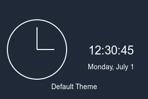
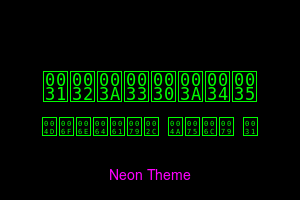
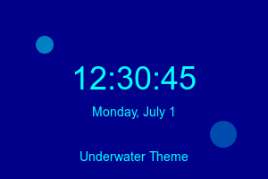
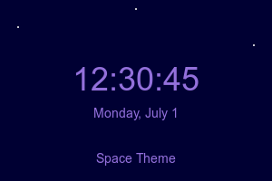

# Advanced Interactive Clock

## Overview

The Advanced Interactive Clock is a highly customizable React component that displays time in both digital and analog formats. It features multiple themes, time zone selection, weather simulation, and various display options.

## Features

- Digital and analog clock displays
- Multiple themes with unique animations
- Time zone selection
- 24-hour and 12-hour format toggle
- Option to show/hide seconds
- Adjustable font size for digital display
- Simulated weather display
- Responsive design

## Theme Previews

### Default Theme


### Neon Theme


### Sunset Theme


### Underwater Theme


### Space Theme


## Installation

1. Clone the repository:
   ```
   git clone https://github.com/your-username/advanced-clock.git
   cd advanced-clock
   ```

2. Install dependencies:
   ```
   npm install
   ```

3. Start the development server:
   ```
   npm start
   ```

## Usage

To use the AdvancedClock component in your React application:

1. Import the component:
   ```jsx
   import AdvancedClock from './path/to/AdvancedClock';
   ```

2. Use the component in your JSX:
   ```jsx
   <AdvancedClock />
   ```

## Customization

The AdvancedClock component offers several customization options:

- **Themes**: Choose from default, neon, sunset, underwater, and space themes.
- **Time Format**: Toggle between 24-hour and 12-hour formats.
- **Seconds Display**: Option to show or hide seconds.
- **Font Size**: Adjust the font size of the digital display.
- **Analog/Digital**: Switch between analog and digital clock faces.
- **Time Zone**: Select from various time zones.

## Project Structure

- `src/AdvancedClock.js`: Main component file
- `src/components/ui/`: UI components (Select, Slider, Switch)
- `src/index.css`: Global styles and Tailwind CSS configuration
- `tailwind.config.js`: Tailwind CSS configuration file

## Dependencies

- React
- Tailwind CSS
- @radix-ui/react-select
- @radix-ui/react-slider
- @radix-ui/react-switch
- lucide-react

## Troubleshooting

If you encounter any issues:

1. Ensure all dependencies are installed correctly.
2. Check that Tailwind CSS is properly configured.
3. Verify that the path to UI components in AdvancedClock.js is correct.

## Contributing

Contributions are welcome! Please feel free to submit a Pull Request.

## License

This project is open source and available under the [MIT License](LICENSE).